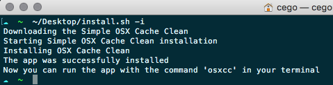
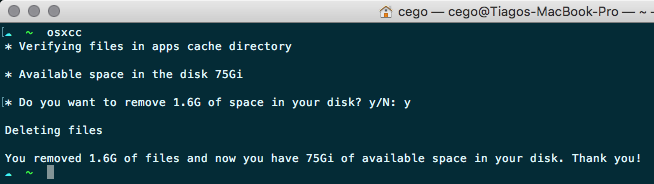

# Simple OSX Cache Clean

## Getting Started

### Prerequisites

* Unix-like operating system (macOS or Linux)
* `curl` or `wget` should be installed
* `git` should be installed

### Basic Installation

Simple OSX Cache Clean is installed by running one of the following commands in your terminal. You can install this via the command-line with either `curl` or `wget`.

#### via curl

```bash
    sh -c "$(curl -fsSL https://raw.githubusercontent.com/actiago/osx-cache-clean/master/install.sh)"
```

#### via wget

```bash
    sh -c "$(wget https://raw.githubusercontent.com/actiago/osx-cache-clean/master/install.sh -O -)"
```

## Usage example

* Install

    

* Run

    

## Features for next version

* New cache files and folders to clean

## License

[MIT](./LICENCE.md)
