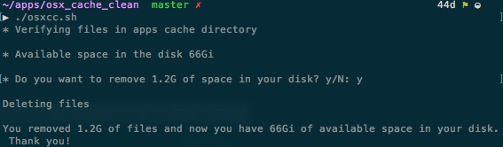

# Simple OSX Cache Clean
###### version 0.0.2.1
#### Clean aplications cache files from Apple OSX.

## How to use:
1. Clone this repository

```bash
    git clone git@github.com:cegohub/osx_cache_clean.git
```

2. Browse to `osx_cache_clean` directory

```bash
    cd osx_cache_clean
```

3. Add execution permission to `osxcc.sh` file

```bash
    chmod +x osxcc.sh
```

Add to add to `.bashrc` or `.zshrc` alias

bashrc:
```bash
    alias clean-cache=`~/your_download_path/osx_cache_clean/osxcc.sh`
```
zshrc:
```bash
    alias clean-cache="~/your_download_path/osx_cache_clean/osxcc.sh"
```

4. Run the script

Without alias
```bash
    ./osxcc.sh
```
With alias
```bash
    clean-cache
````

- Use example

    
