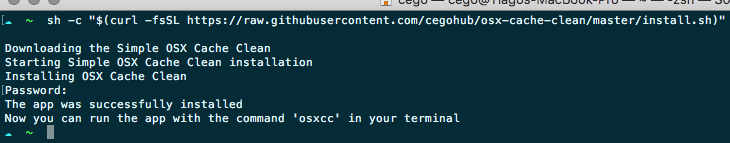

# Simple OSX Cache Clean

## How to use

Clone this repository.

```bash
    git clone git@github.com:cegohub/osx_cache_clean.git
```

Browse to `osx_cache_clean` directory.

```bash
    cd osx_cache_clean
```

Add execution permission to `install.sh` file

```bash
    chmod +x install.sh
```

Run the script to install

```bash
    ./install.sh -i
```

Get the help menu for more options

```bash
    ./install.sh -h
```

## Use example

- Install

    

- Run

    

## Features for next version

- _Check for updates_ command
- _Update_ command

## License

[MIT](./LICENCE.md)
